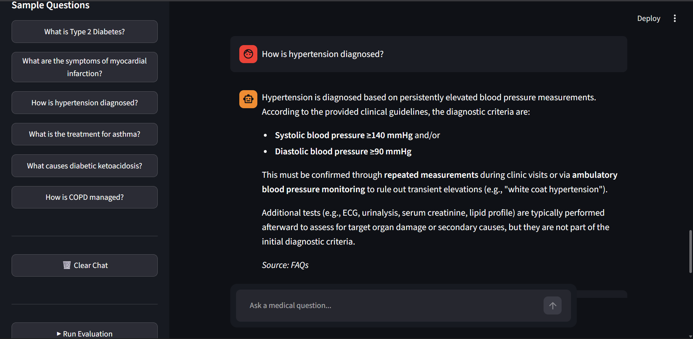
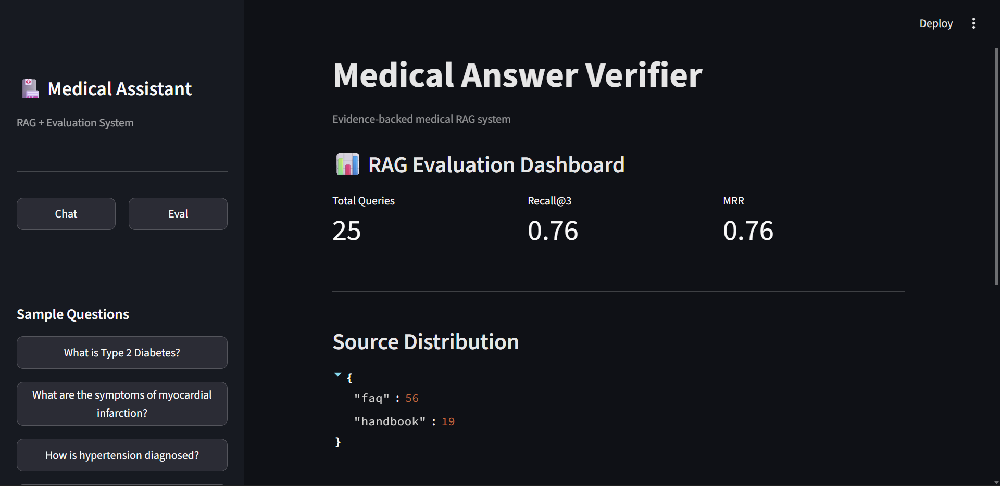

# 🧠 MedInsight_AI  
### Evidence-Backed Medical RAG System

A Retrieval-Augmented Generation (RAG) system for medical question answering using verified clinical sources with evaluation-driven reliability (MRR, Recall@K, source tracking).

---

# 🚀 Overview

**MedInsight_AI** is a domain-specific medical QA system built using a **RAG architecture**.

It retrieves relevant medical knowledge from structured sources and generates grounded, evidence-based answers with minimal hallucination.

It also includes a full evaluation pipeline to measure retrieval quality and system reliability.

---

# ⚙️ Key Features

- 🔎 Semantic search using embeddings  
- 📚 Multi-source knowledge base:
  - Medical FAQs  
  - Clinical Handbook (PDF)  
  - Case-based reasoning data  
- 🧠 Context-aware LLM response generation  
- 📊 Evaluation system:
  - Recall@K  
  - Mean Reciprocal Rank (MRR)  
  - Source distribution analysis  
- 🧾 Structured logging of evaluation runs  
- 🧪 Custom medical benchmark dataset  

---

# 🏗️ System Architecture
User Query
↓
Embedding Model
↓
Vector Database (ChromaDB)
↓
Top-K Retrieval (FAQ + Handbook + Cases)
↓
Context Ranking / Filtering
↓
LLM Answer Generation
↓
Final Evidence-Based Medical Answer

---

# 📂 Project Structure
MedInsight_AI/
│
├── app.py # Main RAG application
│
├── rag_chain.py # LLM + prompt pipeline
├── retriever.py # Retrieval system
│
├── evaluation/
│ ├── eval_metrics.py # MRR & Recall calculation
│ ├── eval_logger.py # Logging evaluation runs
│ ├── eval_dataset.json # Evaluation questions
│ ├── eval_log.json # Raw retrieval outputs
│
├── chroma_store/ # Vector DB storage
├── data/
│ ├── faq/
│ ├── handbook/
│ ├── cases/
│
└── screenshots/
├── chat.png
├── eval.png

---

# 📊 Evaluation Results

| Metric | Score |
|--------|------|
| Recall@3 | 0.80 |
| MRR | 0.80 |

---

# 📦 Source Distribution

- FAQ → dominant retrieval source  
- Handbook → moderate usage  
- Case data → supports clinical reasoning  

---

# 🧪 Evaluation Methodology

The system is tested on **10 curated medical queries** covering:

- Medical definitions  
- Diagnostic criteria  
- Treatment guidelines  
- Pathophysiology  
- Clinical reasoning  
- Multi-step comparisons  

---

# 📸 Screenshots

## 💬 Chat Interface (RAG Output)

---

## 📊 Evaluation Dashboard

---

# ⚠️ Limitations

- Small evaluation dataset (~10–20 queries)
- FAQ-heavy retrieval bias
- Limited rare disease coverage
- No real-time clinical validation layer

---

# 🔮 Future Improvements

- Add MMR-based diversified retrieval tuning  
- Improve handbook chunking strategy  
- Expand dataset (100+ medical queries)  
- Add LLM-based faithfulness scoring  
- Build CI-based evaluation pipeline  
- Add real-time medical knowledge updates  

---

# 🧠 Core Principle

> “Every answer must be traceable to retrieved medical evidence.”

---

# 🛠️ Tech Stack

- Python  
- LangChain / Custom RAG pipeline  
- ChromaDB (Vector Database)  
- Sentence Transformers  
- JSON-based evaluation system  

---

# 📈 Project Status

- ✔ Retrieval system working  
- ✔ Evaluation pipeline active  
- ✔ Grounded responses enforced  
- ⚠ Needs dataset scaling + retrieval tuning  

---

# 🧾 License

For academic and portfolio use only.
